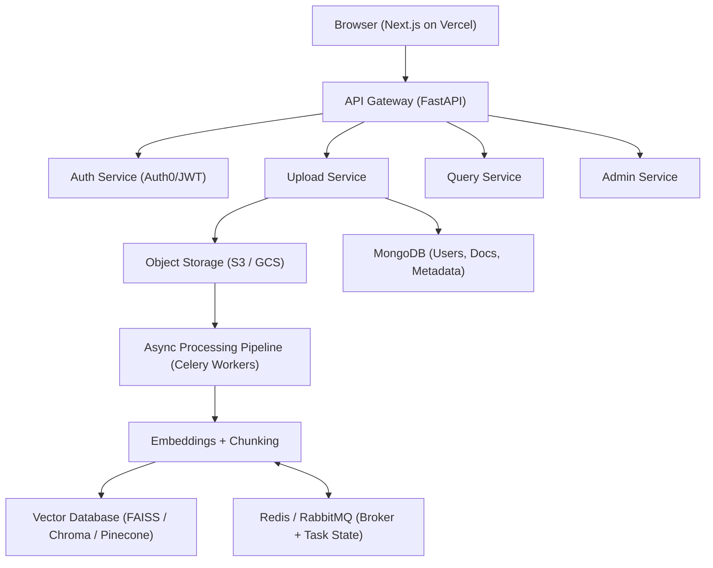

# 📄 IntelliDoc — AI-Powered Document Intelligence Platform  
**Full-Stack · Microservices · Async Pipelines · RAG · Cloud-Native**

---

## 📌 Overview

**IntelliDoc** is a **full-stack AI document intelligence platform** that allows users to upload, process, and query large unstructured documents using **natural language**.

Unlike demo-level AI apps, IntelliDoc is engineered as a **production-ready system**, covering:
- Backend microservices
- Distributed async pipelines
- RAG-based semantic search
- Modern frontend
- Multi-cloud deployment
- Analytics & observability

> IntelliDoc is designed as a **complete product**, not just a backend experiment.

---

## 🚀 Why IntelliDoc?

Most AI projects stop at:
- A backend API
- A basic UI
- No monitoring or deployment strategy

**IntelliDoc goes further.**

### Key Highlights
- ✅ Full-stack architecture (Frontend + Backend + AI)
- ✅ Microservices-based backend
- ✅ Dual-pipeline AI system (Ingestion + RAG Query)
- ✅ Tri-database architecture
- ✅ Secure authentication (Auth0 / JWT)
- ✅ Multi-cloud deployment strategy
- ✅ Analytics & monitoring baked in
- ✅ 100% Mocked Offline Testing Architecture (228+ Tests)

---

## 🖥️ Frontend Architecture (Next.js)

**Status:** 🚧 In Progress

The frontend is built using **Next.js** and serves as the primary user interface.

### Responsibilities
- Authentication & session handling
- Document upload interface
- Processing status visualization
- Semantic search UI
- RAG-based Q&A experience
- Admin & monitoring views (planned)

### Why Next.js?
- Server-side rendering (performance + SEO)
- Seamless API integration
- Auth-friendly architecture
- Production-grade routing & layouts

---

## 🏗️ Full System Architecture

---

## 🔁 Dual-Pipeline AI Architecture

IntelliDoc uses **two independent but connected pipelines**, each optimized for a different workload.

---

## ⚙️ Pipeline 1 — Document Ingestion & Indexing (Async)

**Purpose:** Convert uploaded documents into searchable semantic knowledge.

**Trigger:** Document upload

### Flow
Upload → Storage → Celery → Chunking → Embeddings → Vector DB

markdown
Copy code

### Details
- Metadata stored in MongoDB
- Files stored in object storage (S3 / GCS)
- Celery workers handle:
  - Parsing
  - Chunking
  - Embedding generation
- Status tracked via Redis

**Characteristics**
- Fully asynchronous
- Fault-tolerant with retries
- Horizontally scalable
- Non-blocking APIs

**Status:** ✅ Implemented

---

## 🧠 Pipeline 2 — RAG-Based Semantic Search & Querying

**Purpose:** Answer natural language questions using document-grounded context.

**Trigger:** User query

### Flow
Query → Embedding → Vector Search → Context → LLM → Answer

yaml
Copy code

### Why Separate This Pipeline?

| Ingestion Pipeline | Query Pipeline |
|-------------------|--------------|
| Async & heavy | Low-latency |
| CPU/GPU bound | Memory/network bound |
| Retry-tolerant | User-facing |
| Background jobs | Real-time |

Separating pipelines enables:
- Independent scaling
- Cleaner code boundaries
- Better performance guarantees

**Status:** 🚧 In Progress

---

## 🔐 Authentication & Authorization

**Status:** ✅ Implemented

- Auth0-based authentication
- JWT validation at API Gateway
- Secure user isolation
- Per-user document ownership
- Multi-tenant safe access

---

## 📄 Document Upload & Storage

**Status:** ✅ Implemented

- Supports PDF, DOCX, TXT
- Secure validation & integrity checks
- Cloud object storage integration
- MongoDB stores:
  - Document metadata
  - Processing state
  - Ownership mapping

---

## ⚙️ Distributed Async Processing

**Status:** ✅ Implemented

- Celery workers for heavy workloads
- Redis / RabbitMQ as message broker
- Retry-safe background jobs
- Real-time job status tracking

---

## 🧠 Embeddings & Vector Search

**Status:** ✅ Implemented

- Chunk-level semantic embeddings
- Vector similarity search
- Pluggable vector DB design
- Optimized for RAG workflows

Supported / Planned:
- FAISS
- Chroma
- Pinecone

---

## 🔎 Retrieval-Augmented Generation (RAG)

**Status:** 🚧 In Progress

### Why RAG?
- Documents change frequently
- Fine-tuning is expensive & static
- Enables:
  - Grounded answers
  - Reduced hallucinations
  - Real-time updates
  - Explainability

---

## 🗄️ Tri-Database Architecture

| Responsibility | Technology |
|---------------|------------|
| Auth & Metadata | MongoDB |
| Vector Search | FAISS / Chroma / Pinecone |
| File Storage | AWS S3 / GCS |
| Task Queue & State | Redis / RabbitMQ + Celery |

> Each database is used only for what it does best.

---

## 🌍 Three-Way Cloud Deployment Strategy

IntelliDoc follows a **multi-cloud deployment model**.

### 🔹 Vercel (Frontend)
- Hosts Next.js frontend
- Edge-optimized delivery
- Integrated analytics

### 🔹 Railway (Backend)
- Hosts FastAPI microservices
- Runs Celery workers
- Manages Redis / RabbitMQ

### 🔹 Hugging Face Spaces (AI)
- Hosts LLM demos & inference services
- Used for model experimentation
- Decouples AI workloads from core backend

---

## 📊 Analytics & Observability

### 🔍 Vercel Analytics (Frontend)
Used to:
- Track user behavior
- Measure page performance
- Analyze real-world UX metrics

### 📈 Grafana (Backend Monitoring)
Used to:
- Monitor service health
- Track Celery worker performance
- Observe queue lengths & failures
- Debug bottlenecks in production

> Observability ensures IntelliDoc is operable, not just deployable.

---

## 🧪 Full-Stack Testing Architecture

**Status:** ✅ Implemented

IntelliDoc features a robust, production-grade automated testing architecture across the entire platform. Designed to run completely offline, it ensures **100% mocked infrastructure** with zero live API calls.

- **Auth Service (Node.js):** Jest, ts-jest, Supertest (In-memory MongoDB, stubbed Auth0)
- **AI Backend (Python):** pytest, pytest-mock, httpx (Synchronous Celery task execution, mocked ML integrations)
- **Frontend (Next.js):** Vitest, React Testing Library, Playwright, MSW (API interception, complex layout mocking)

**Total Tests:** 228+  
For extensive details, view the [Full Testing Architecture](TESTING.md).

---

## 🛠️ Tech Stack

### Frontend
- Next.js
- TypeScript
- Tailwind CSS

### Backend
- FastAPI
- Python 3.11+
- Celery

### Messaging
- Redis
- RabbitMQ

### Databases
- MongoDB
- Vector Databases

### AI
- LLMs (OpenAI / Hugging Face)
- Embeddings
- RAG architecture

### DevOps & Deployment
- Docker
- Vercel
- Railway
- Hugging Face Spaces
- Grafana

### Testing
- Jest, Supertest
- Pytest, pytest-mock
- Vitest, Playwright, MSW

---

## 📈 Scalability & Reliability

- Stateless microservices
- Horizontally scalable workers
- Retry-safe async pipelines
- Cloud-native deployment
- Strong user-level isolation

---

## 🧭 Roadmap

### Phase 1 — Core Platform ✅
- [x] Backend microservices
- [x] Auth0 authentication
- [x] Async pipelines
- [x] Tri-DB architecture
- [x] Dockerized deployment
- [x] Automated full-stack test suite (228+ tests)

### Phase 2 — Intelligence 🚧
- [ ] Advanced RAG
- [ ] Prompt optimization
- [ ] Source citation
- [ ] Streaming responses

### Phase 3 — Productization 🔜
- [ ] Next.js dashboard
- [ ] Monitoring dashboards
- [ ] Role-based access control
- [ ] Multi-tenant support

---

## 🧠 What Makes IntelliDoc Stand Out

- Full-stack AI platform
- Dual-pipeline RAG architecture
- Production-grade async processing
- Multi-cloud deployment
- Built with observability in mind
- Designed like a real startup product

---

## 👨‍💻 Author

**Prathmesh Desai**  
AI Systems Engineer · Full-Stack Developer  

---

> IntelliDoc is built to demonstrate **end-to-end AI system design**, not just APIs or ML demos.
